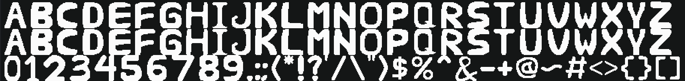

# Ririgitriz

**Ririgitriz** is a pixel-style font. Intended for my pixel game, but turn out it's not a good font, this is my first font i made. Thanks for seeing this font!

---

## Properties

| Property | Value |
| :--- | :--- |
| **Style** | Pixel Handdrawn |
| **Weight** | Regular |
| **Em Square (Grid Size)** | 48 × 48 pixels |
| **FontForge Metrics** | Ascent: 40, Descent: 8 |
| **Format** | TTF |
| **License** | [SIL Open Font License (OFL)](LICENSE) |
 
---

